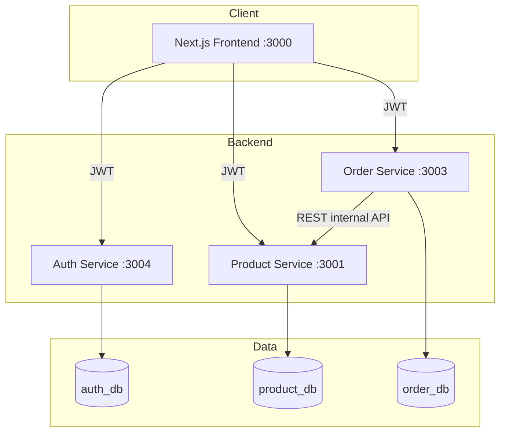

# Revest Solutions — Senior Full Stack Developer Assignment

Production-grade retail platform: NestJS microservices, PostgreSQL, JWT auth, and a Next.js storefront with cart, checkout, and admin console.

## Project Structure

```
revest-assignment/
├── backend/
│   ├── auth-service/        # Users, JWT, roles, audit logs (port 3004)
│   ├── product-service/     # Catalog, inventory, auto-seed (port 3001)
│   └── order-service/       # Orders, stock reservation (port 3003)
├── frontend/                # Next.js App Router + MUI (port 3000)
├── e2e/                     # Playwright functional, regression & E2E tests
├── scripts/                 # DB init helpers
├── docker/
├── docker-compose.yml
├── SETUP-WITHOUT-DOCKER.md
├── TESTING.md
└── README.md
```

## Architecture



### Design Decisions

| Decision | Rationale |
|----------|-----------|
| **REST over gRPC** | Simpler debugging, Swagger docs, aligns with assignment flexibility |
| **Separate databases** | Microservice data isolation (`auth_db`, `product_db`, `order_db`) |
| **Shared JWT secret** | Auth issues tokens; product/order services validate locally |
| **Internal product API** | Order service reserves stock without exposing public JWT to server-to-server calls |
| **Repository pattern** | Decouples business logic from TypeORM persistence |
| **JSON-driven signup** | Dynamic form fields from `form-schema.json` with renderer registry |
| **Startup catalog seed** | 9 retail SKUs auto-inserted when missing; legacy seeds removed |

## Application Features

### Customer (USER role)
- Signup / login with JWT
- Product catalog with live stock
- Shopping cart (persisted per user)
- Checkout and order confirmation
- My orders list and order detail

### Admin (ADMIN role)
- Operations dashboard (KPIs, quick actions, activity feed)
- Product, order, user, and audit log management
- Default admin seeded on first auth-service start

**Default admin:** `admin@revest.sa` / `Admin@123`

### Catalog seed (product-service)
On startup, 9 consumer retail products are inserted if their SKU is missing (e.g. `RET-DAIRY-001` Almarai Laban, `RET-GROC-003` Basmati Rice). Deprecated `RVST-*` demo SKUs are removed automatically.

## Prerequisites

- Node.js 20+
- npm
- **PostgreSQL 16** (local — see [SETUP-WITHOUT-DOCKER.md](./SETUP-WITHOUT-DOCKER.md))
- Docker *(optional)*

## Quick Start — No Docker (Windows)

> Full steps: **[SETUP-WITHOUT-DOCKER.md](./SETUP-WITHOUT-DOCKER.md)**

### 1. Create databases

```powershell
$env:PGPASSWORD = "YOUR_POSTGRES_PASSWORD"
psql -U postgres -f scripts/init-databases.sql
```

If `auth_db` is missing later: `npm run db:auth` (see setup doc).

### 2. Start all services (4 terminals)

```bash
# Terminal 1 — Auth Service
cd backend/auth-service && cp .env.example .env && npm install && npm run start:dev

# Terminal 2 — Product Service
cd backend/product-service && cp .env.example .env && npm install && npm run start:dev

# Terminal 3 — Order Service
cd backend/order-service && cp .env.example .env && npm install && npm run start:dev

# Terminal 4 — Frontend
cd frontend && npm install && npm run dev
```

Open http://localhost:3000

With `DB_SYNCHRONIZE=true` in `.env` (default in `.env.example`), migrations are **not required** for local dev.

## Service URLs

| Service | URL |
|---------|-----|
| Frontend | http://localhost:3000 |
| Product API | http://localhost:3001 |
| Product Swagger | http://localhost:3001/api/docs |
| Order API | http://localhost:3003 |
| Order Swagger | http://localhost:3003/api/docs |
| Auth API | http://localhost:3004 |
| Auth Swagger | http://localhost:3004/api/docs |
| PostgreSQL | localhost:5432 |

## Quick Start — Docker (optional)

```bash
docker compose up -d --build
```

> Docker Compose currently runs product + order services. For full auth + frontend locally, start `auth-service` and `frontend` separately (see setup doc).

## Environment Variables

See per-service `.env.example` files.

| Variable | Service | Description |
|----------|---------|-------------|
| `PORT` | All | HTTP port |
| `DB_HOST`, `DB_NAME`, … | All | PostgreSQL connection |
| `JWT_SECRET` | Auth, Product, Order | Shared secret for JWT validation |
| `DB_SYNCHRONIZE` | All | `true` for local dev; `false` in production |
| `PRODUCT_SERVICE_URL` | Order | Product service base URL |
| `AUTH_SERVICE_URL` | Product, Order | Audit log forwarding |

## API Examples

All protected routes require `Authorization: Bearer <token>`.

### Login

```bash
curl -X POST http://localhost:3004/auth/login \
  -H "Content-Type: application/json" \
  -d '{"email":"admin@revest.sa","password":"Admin@123"}'
```

### List products

```bash
curl http://localhost:3001/products?limit=10 \
  -H "Authorization: Bearer YOUR_TOKEN"
```

### Place order

```bash
curl -X POST http://localhost:3003/orders \
  -H "Content-Type: application/json" \
  -H "Authorization: Bearer YOUR_TOKEN" \
  -d '{"items":[{"productId":"<PRODUCT_UUID>","quantity":1}]}'
```

Response envelope:

```json
{
  "success": true,
  "data": { "id": "...", "totalAmount": 42.0, "status": "CONFIRMED", "products": [] },
  "timestamp": "2026-06-28T..."
}
```

## Testing

See **[TESTING.md](./TESTING.md)** for full details.

```bash
npm run test:unit        # Jest + Vitest (no services required)
npm run test:e2e         # Playwright (all 4 services + frontend)
npm run test:functional  # API-only tests
npm run test:regression  # Regression suite
npm run test:all         # Unit + E2E
```

Install Playwright browser once: `npx playwright install chromium`

## Backend Folder Structure (per service)

```
src/
├── common/           # Filters, interceptors, JWT guards, DTOs
├── config/           # ConfigModule registration
├── database/         # Migrations, catalog seed (product-service)
├── modules/          # Feature modules (auth, products, orders, …)
├── clients/          # Inter-service HTTP clients
└── main.ts
```

## Frontend Highlights

- **Auth** — JWT in localStorage, protected routes, role-based redirects
- **Dynamic signup** — JSON schema drives TEXT / LIST fields
- **Retail UX** — Catalog → cart → checkout → order tracking
- **Admin console** — Dashboard, CRUD, audit trail
- **Theme** — Light/dark mode, MUI 6, responsive layout

## Tech Stack

| Layer | Technologies |
|-------|-------------|
| Backend | NestJS 10, TypeORM, PostgreSQL, Passport JWT, Swagger, Terminus, Throttler |
| Frontend | Next.js 14, TypeScript, MUI 6, React Hook Form, Zod |
| Testing | Jest, Vitest, Playwright |
| Infra | Docker Compose, GitHub Actions CI |

## Implemented Extras

- JWT authentication and role guards (USER / ADMIN)
- Auth microservice with audit logging
- Health checks (`/health`) on all services
- API rate limiting (100 req/min)
- Global exception filter and response interceptor
- Unit tests (auth, product, order, frontend utilities)
- Playwright E2E, functional, and regression tests
- Auto-seeded retail catalog and default admin user
- GitHub Actions CI pipeline

## Author

Assignment submission for Revest Solutions — Senior Full Stack Developer
